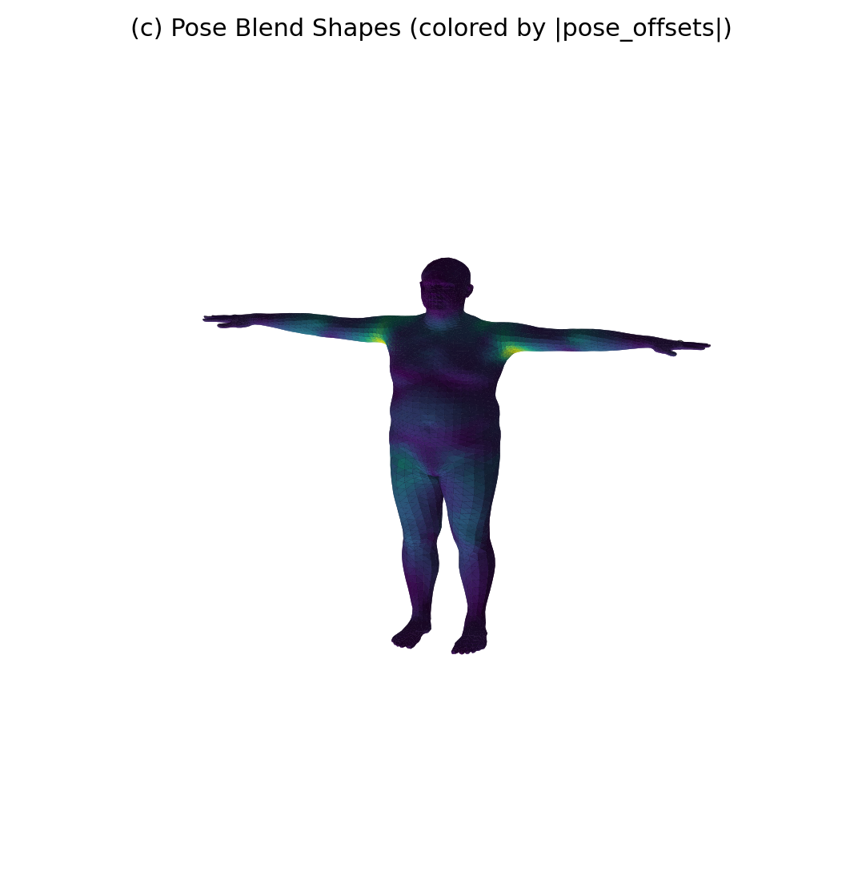
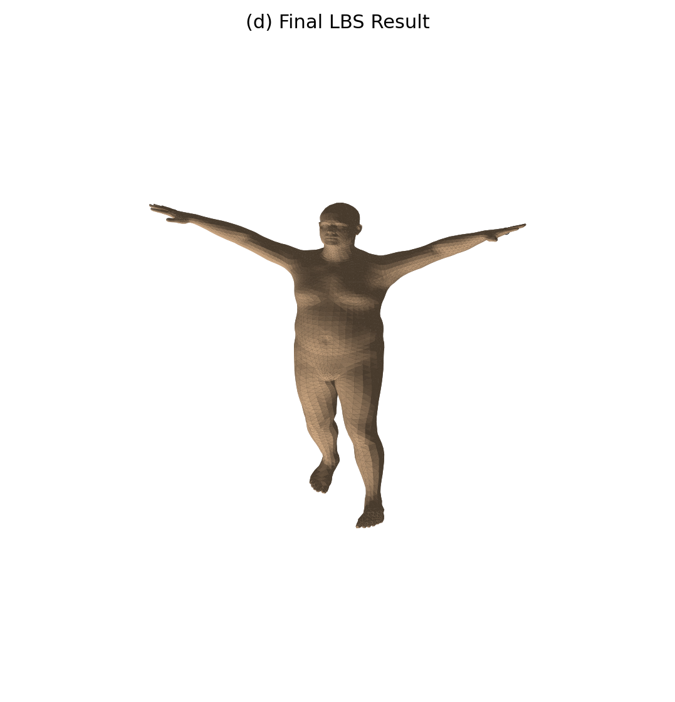
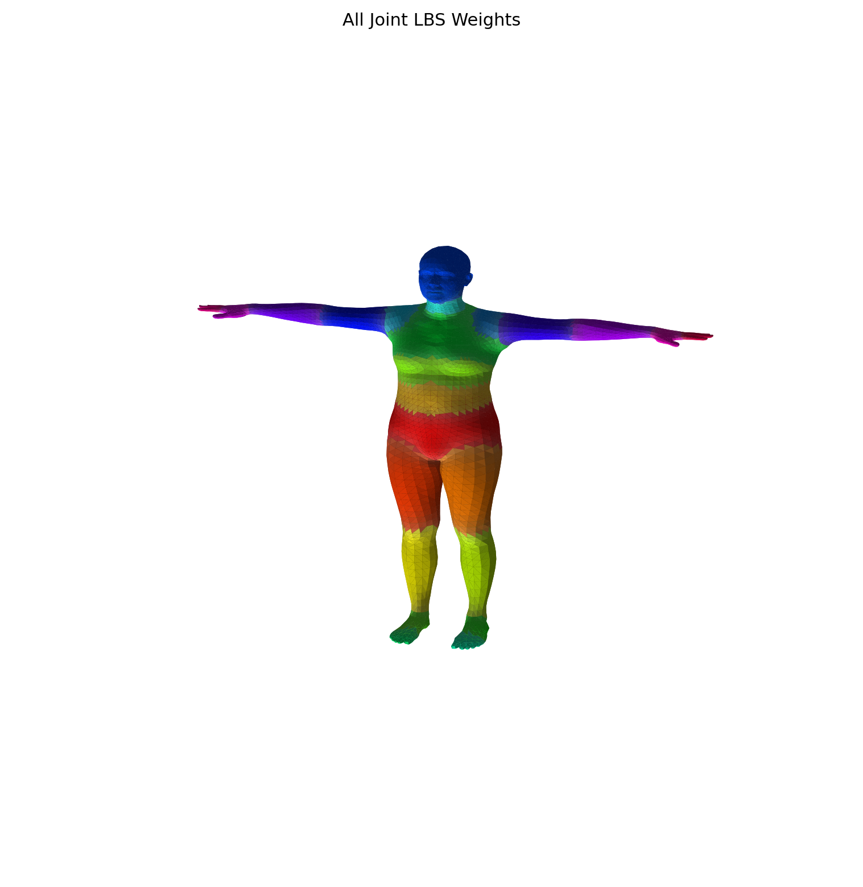
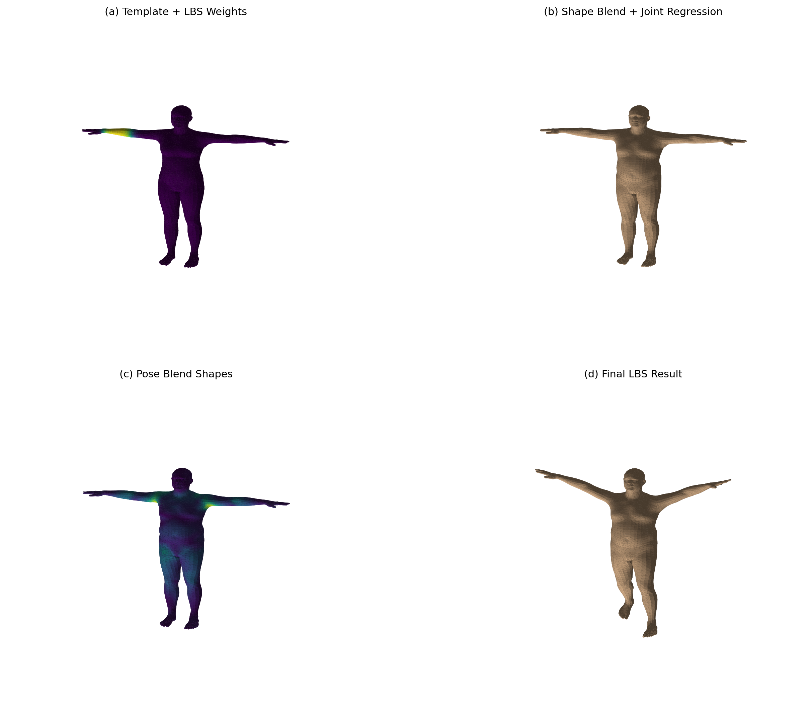

# 计算机图形学实验八：SMPL 模型与 LBS 骨骼动画

**罗晓政202411081010**

## 实验目的

本实验实现了一个完整的 SMPL（Skinned Multi-Person Linear Model）骨骼蒙皮动画系统，主要目的包括：

1. 理解 SMPL 模型的数学原理和构成
2. 掌握 LBS（Linear Blend Skinning）线性骨骼蒙皮的计算流程
3. 实现骨骼蒙皮的各个阶段：模板网格、形状混合、姿态校正、刚性变换
4. 可视化 LBS 权重和各个阶段的中间结果
5. 验证手写实现与官方实现的数值一致性

## 实现原理

### SMPL 模型概述

SMPL 是一种参数化人体模型，可以表示为：

```
M(β, θ) = (K, J, θ, ω, P)
```

其中：
- **β**：形状参数（Shape Parameters），控制体型
- **θ**：姿态参数（Pose Parameters），控制关节旋转
- **K**：顶点数（6890 个）
- **J**：关节点（24 个）
- **P**：混合系数

### LBS 流水线

LBS（线性骨骼蒙皮）将骨骼变换应用于网格顶点，公式为：

```
v_final = Σ(w_i × T_i) × v_local
```

其中：
- **w_i**：第 i 个关节的 LBS 权重
- **T_i**：第 i 个关节的变换矩阵（包含旋转和平移）
- **v_local**：顶点局部坐标

### 四个计算阶段

本实验将 LBS 分解为四个阶段，逐步实现：

#### 阶段 A：模板网格 + LBS 权重

- 使用预定义的模板网格（T-Pose）
- 定义每个顶点受各关节影响的权重
- 权重决定了顶点在关节运动时的变形方式

#### 阶段 B：形状混合 + 关节回归

1. **形状混合**：`v_shaped = v_template + Σ(β_i × B_i)`
2. **关节回归**：使用回归矩阵从顶点预测关节位置

#### 阶段 C：姿态校正

添加姿态混合形状来补偿肌肉膨胀效果：

```
v_posed = v_shaped + Σ(R_i - I) × P_i
```

其中 R_i 是关节旋转矩阵

#### 阶段 D：最终 LBS 变换

1. 构建关节层级变换树
2. 计算每个关节的刚体变换矩阵
3. 应用 LBS 权重混合所有变换

## 环境配置

### 依赖项

```
pip install torch numpy matplotlib smplx
```

### 模型文件

需要下载 SMPL 模型文件 `SMPL_NEUTRAL.pkl`，放置在以下位置：

```
Work8/models/smpl/SMPL_NEUTRAL.pkl
```

## 使用方法

### 基本运行

```bash
cd Work8
python run_lbs_lab.py
```

### 参数说明

| 参数 | 默认值 | 说明 |
|------|--------|------|
| `--model-dir` | `./models` | 模型文件所在目录 |
| `--out-dir` | `./outputs` | 输出图片和摘要的目录 |
| `--joint-id` | `18` | 可视化权重时指定的关节 ID（0-23） |
| `--num-betas` | `10` | 形状参数 β 的数量 |

### 查看各阶段结果

运行后，outputs 目录会生成以下文件：

- `stage_a_template_weights.png`：模板网格 + 指定关节权重
- `stage_b_shaped_joints.png`：形状混合 + 关节位置
- `stage_c_pose_offsets.png`：姿态混合形状
- `stage_d_lbs_result.png`：最终 LBS 结果
- `comparison_grid.png`：四个阶段的对比网格图
- `all_joint_weights.png`：所有 24 个关节的权重分布
- `summary.txt`：运行摘要信息

### 可视化指定关节

使用 `--joint-id` 可以选择要可视化的关节：

```bash
# 可视化第 18 号关节（默认，左肘）
python run_lbs_lab.py --joint-id 18

# 可视化第 1 号关节（左髋关节）
python run_lbs_lab.py --joint-id 1
```

### 关节 ID 对照表

| ID | 关节名称 | ID | 关节名称 |
|----|---------|-----|---------|
| 0 | Pelvis | 12 | Right Thumb |
| 1 | Left Hip | 13 | Right Index |
| 2 | Right Hip | 14 | Right Middle |
| 3 | Spine1 | 15 | Right Pinky |
| 4 | Left Knee | 16 | Right Hand |
| 5 | Right Knee | 17 | Right Forearm |
| 6 | Spine2 | 18 | Right Elbow |
| 7 | Left Ankle | 19 | Right Arm |
| 8 | Right Ankle | 20 | Right Shoulder |
| 9 | Left Foot | 21 | Head |
| 10 | Right Foot | 22 | Neck |
| 11 | Left Hand | 23 | Head Top |

## 实验结果

### 运行摘要

```
===== SMPL LBS Lab Summary =====
num_vertices: 6890
num_faces: 13776
num_joints(from lbs_weights): 24
num_betas: 10
visualized_joint_id: 18
manual_vs_official_mean_abs_error: 0.0000000000
manual_vs_official_max_abs_error: 0.0000000000
```

### 数值验证

手写实现的 LBS 与官方 `smplx` 前向传播的误差为 **0.0**，证明实现正确性。

### 生成的图片

#### 阶段 A：模板网格 + LBS 权重


顶点颜色表示第 18 号关节（右肘）的 LBS 权重分布。

#### 阶段 B：形状混合 + 关节回归


应用形状参数 β 后的人体网格，白色点为回归的关节位置。

#### 阶段 C：姿态混合形状



姿态校正导致的顶点偏移，颜色表示偏移量的大小。

#### 阶段 D：最终 LBS 结果



经过完整 LBS 变换后的最终人体姿态。

#### 关节权重总览



展示所有 24 个关节的 LBS 权重分布，每个关节用不同颜色表示。

#### 四阶段对比网格



包含四个子图：
- **(a) Template + LBS Weights**：模板网格，顶点颜色表示第 18 号关节的权重
- **(b) Shape Blend + Joint Regression**：应用形状参数后的网格和关节位置
- **(c) Pose Blend Shapes**：姿态混合导致的顶点偏移，颜色表示偏移量大小
- **(d) Final LBS Result**：经过完整 LBS 变换后的最终结果

## 项目结构

```
Work8/
├── run_lbs_lab.py           # 主程序代码
├── models/
│   └── smpl/
│       └── SMPL_NEUTRAL.pkl  # SMPL 模型文件（需自行下载）
├── outputs/                  # 输出目录（运行时生成）
│   ├── summary.txt
│   ├── comparison_grid.png
│   ├── all_joint_weights.png
│   ├── stage_a_template_weights.png
│   ├── stage_b_shaped_joints.png
│   ├── stage_c_pose_offsets.png
│   └── stage_d_lbs_result.png
└── README.md
```

## 技术要点

### 1. Chumpy 兼容处理

旧版 SMPL 模型使用 chumpy 库存储数据，本代码实现了 pickle shim 来兼容：

```python
install_chumpy_pickle_shim()
```

### 2. Rodrigues 公式

将轴角表示的旋转转换为旋转矩阵：

```python
rot_mats = batch_rodrigues(full_pose.view(-1, 3))
```

### 3. 刚性变换批处理

使用 `batch_rigid_transform` 计算关节层级变换：

```python
J_transformed, A = batch_rigid_transform(rot_mats, J, parents)
```

### 4. LBS 权重混合

将顶点坐标扩展为齐次坐标，然后应用混合变换：

```python
T = torch.matmul(W, A.view(1, num_joints, 16))
v_final = torch.matmul(T, v_homo)[:, :, :3, 0]
```